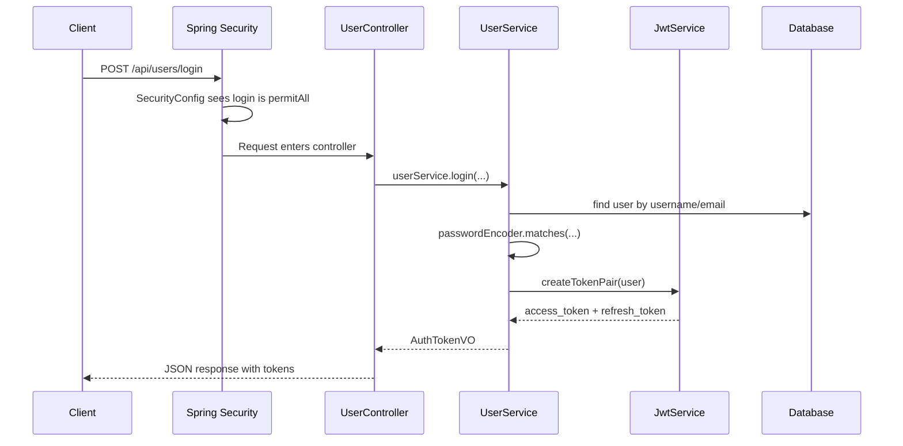
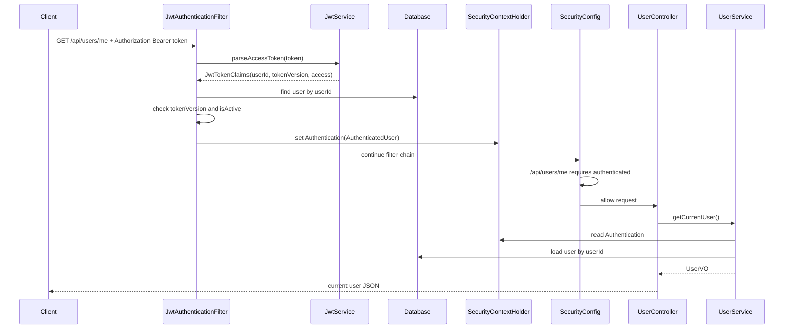
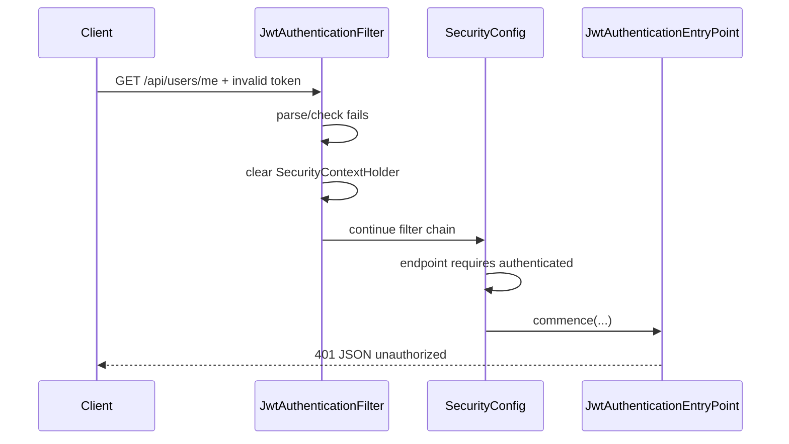

# Dublin Bikes 后端 Spring Security 工作方式说明

这篇文档面向第一次接触 Spring Security 的读者，解释本项目后端为什么需要 Spring Security、每个文件负责什么、一条请求如何被认证，以及代码之间怎样协同。

## 一句话版本

本项目是一个前后端分离的 REST API。用户登录成功后，后端签发 JWT；前端之后每次访问受保护接口时，在 HTTP header 里带上：

```http
Authorization: Bearer <access_token>
```

后端的 Spring Security 会先拦截请求。如果 token 合法，就把“当前登录用户是谁”写进 Spring Security 的上下文；如果接口要求登录但没有合法 token，就返回 `401 unauthorized`。

## 先认识几个概念

### Authentication

Authentication 的意思是“认证”，回答的问题是：

> 这个请求是谁发来的？

在本项目里，认证依据是 JWT access token。token 解析成功后，我们认为请求来自某个用户 ID。

### Authorization

Authorization 的意思是“授权”，回答的问题是：

> 这个用户能不能访问这个接口？

在本项目里，规则比较简单：

- `/actuator/health` 公开。
- `GET /api/stations/**` 公开。
- `GET /api/weather` 公开。
- `POST /api/journey/**` 公开（路线规划接口，目前在 `SecurityConfig` 中预留）。
- 部分用户注册、登录、激活、刷新 token 接口公开。
- `GET /api/users/me` 必须登录。
- `POST /api/users/logout` 必须登录。
- 其他接口默认拒绝。

### Filter Chain

Spring Security 的核心是 filter chain。可以把它理解为请求进入 controller 前的一组检查点。

请求大致会这样流动：

```text
Client
  -> Servlet filters
  -> Spring Security filter chain
  -> JwtAuthenticationFilter
  -> Authorization rules
  -> Controller
  -> Service
  -> Repository
```

如果中途认证或授权失败，请求不会进入 controller。

### SecurityContextHolder

`SecurityContextHolder` 是 Spring Security 保存“当前请求认证信息”的地方。

它默认使用线程绑定的上下文。你可以把它理解为框架管理的 ThreadLocal，但不要把它等同于自己手写 `ThreadLocal`：

- 自己写 `ThreadLocal` 时，必须自己 `remove()`，否则 servlet 线程池复用时可能串用户。
- Spring Security 会在请求生命周期内管理和清理 `SecurityContextHolder`。
- 所以本项目使用 Spring Security 上下文，而不是自己维护一个 `ThreadLocal<User>`。

## 相关文件总览

本项目和 Spring Security 认证相关的核心文件如下：

```text
backend/pom.xml
backend/src/main/java/dev/kaiwen/bikes/DublinBikesApplication.java
backend/src/main/java/dev/kaiwen/bikes/config/SecurityConfig.java
backend/src/main/java/dev/kaiwen/bikes/config/PasswordConfig.java
backend/src/main/java/dev/kaiwen/bikes/security/JwtAuthenticationFilter.java
backend/src/main/java/dev/kaiwen/bikes/security/JwtAuthenticationEntryPoint.java
backend/src/main/java/dev/kaiwen/bikes/security/AuthenticatedUser.java
backend/src/main/java/dev/kaiwen/bikes/security/JwtTokenClaims.java
backend/src/main/java/dev/kaiwen/bikes/service/JwtService.java
backend/src/main/java/dev/kaiwen/bikes/service/UserService.java
```

职责划分：

| 文件 | 职责 |
| --- | --- |
| `pom.xml` | 引入 Spring Security 和 JWT 依赖 |
| `DublinBikesApplication` | 启动应用，并关闭默认内存用户自动配置 |
| `SecurityConfig` | 定义安全规则：哪些接口公开，哪些必须登录，其他默认拒绝 |
| `PasswordConfig` | 提供 BCrypt 密码加密器 |
| `JwtAuthenticationFilter` | 每次请求进 controller 前尝试解析 access token |
| `JwtAuthenticationEntryPoint` | 未认证时返回统一 JSON `401` |
| `AuthenticatedUser` | 放进 Spring Security 上下文的当前用户对象 |
| `JwtTokenClaims` | token 解析后的结构化结果 |
| `JwtService` | 创建和解析 JWT |
| `UserService` | 登录、刷新、登出、获取当前用户 |

## 依赖如何引入

`backend/pom.xml` 里引入了：

```xml
<dependency>
  <groupId>org.springframework.boot</groupId>
  <artifactId>spring-boot-starter-security</artifactId>
</dependency>
<dependency>
  <groupId>io.jsonwebtoken</groupId>
  <artifactId>jjwt-api</artifactId>
  <version>0.12.6</version>
</dependency>
<dependency>
  <groupId>io.jsonwebtoken</groupId>
  <artifactId>jjwt-impl</artifactId>
  <version>0.12.6</version>
  <scope>runtime</scope>
</dependency>
<dependency>
  <groupId>io.jsonwebtoken</groupId>
  <artifactId>jjwt-jackson</artifactId>
  <version>0.12.6</version>
  <scope>runtime</scope>
</dependency>
```

逐行解释：

- `spring-boot-starter-security`：引入 Spring Security 的过滤器链、认证上下文、授权规则、密码加密等能力。
- `jjwt-api`：编译期使用的 JWT API。
- `jjwt-impl`：运行时真正执行 JWT 签名、解析、校验的实现。
- `jjwt-jackson`：让 JJWT 能用 Jackson 处理 JSON claims。
- `runtime`：表示代码编译时不直接依赖实现类，但运行时需要它们。

## 为什么关闭默认内存用户

`DublinBikesApplication` 里有：

```java
@SpringBootApplication(exclude = UserDetailsServiceAutoConfiguration.class)
```

逐行解释：

- `@SpringBootApplication` 是 Spring Boot 应用入口注解。
- `exclude = UserDetailsServiceAutoConfiguration.class` 表示不要让 Spring Boot 自动创建一个默认内存用户。

为什么要关掉？

引入 `spring-boot-starter-security` 后，如果你没有提供用户体系，Spring Boot 会生成一个默认用户和随机密码，并在日志里打印：

```text
Using generated security password: ...
```

本项目不是用这个默认用户登录，而是用自己的 `users` 表、登录接口和 JWT。因此默认内存用户没有价值，还容易误导调试。

## SecurityConfig：安全规则中心

核心代码：

```java
@Configuration
@EnableWebSecurity
@RequiredArgsConstructor
public class SecurityConfig {

    private final JwtAuthenticationFilter jwtAuthenticationFilter;
    private final JwtAuthenticationEntryPoint authenticationEntryPoint;

    @Bean
    public SecurityFilterChain securityFilterChain(HttpSecurity http) throws Exception {
        http.csrf(csrf -> csrf.disable())
                .httpBasic(AbstractHttpConfigurer::disable)
                .formLogin(AbstractHttpConfigurer::disable)
                .logout(AbstractHttpConfigurer::disable)
                .sessionManagement(
                        session -> session.sessionCreationPolicy(SessionCreationPolicy.STATELESS))
                .exceptionHandling(
                        exceptions -> exceptions.authenticationEntryPoint(authenticationEntryPoint))
                .authorizeHttpRequests(
                        auth ->
                                auth.requestMatchers("/actuator/health")
                                        .permitAll()
                                        .requestMatchers(HttpMethod.GET, "/api/stations/**")
                                        .permitAll()
                                        .requestMatchers(HttpMethod.GET, "/api/weather")
                                        .permitAll()
                                        .requestMatchers(HttpMethod.POST, "/api/journey/**")
                                        .permitAll()
                                        .requestMatchers(HttpMethod.POST, "/api/users/register")
                                        .permitAll()
                                        .requestMatchers(
                                                HttpMethod.POST, "/api/users/send-verification-code")
                                        .permitAll()
                                        .requestMatchers(HttpMethod.POST, "/api/users/activate")
                                        .permitAll()
                                        .requestMatchers(
                                                HttpMethod.POST, "/api/users/activate-by-token")
                                        .permitAll()
                                        .requestMatchers(HttpMethod.POST, "/api/users/login")
                                        .permitAll()
                                        .requestMatchers(HttpMethod.POST, "/api/users/refresh")
                                        .permitAll()
                                        .requestMatchers(HttpMethod.GET, "/api/users/me")
                                        .authenticated()
                                        .requestMatchers(HttpMethod.POST, "/api/users/logout")
                                        .authenticated()
                                        .anyRequest()
                                        .denyAll())
                .addFilterBefore(
                        jwtAuthenticationFilter, UsernamePasswordAuthenticationFilter.class);
        return http.build();
    }
}
```

逐段解释：

```java
@Configuration
```

告诉 Spring：这是一个配置类，里面的 `@Bean` 方法会被 Spring 管理。

```java
@EnableWebSecurity
```

启用 Spring Security 的 Web 安全能力。

```java
@RequiredArgsConstructor
```

Lombok 注解。它会为 `final` 字段生成构造函数，所以 Spring 可以注入：

- `JwtAuthenticationFilter`
- `JwtAuthenticationEntryPoint`

```java
private final JwtAuthenticationFilter jwtAuthenticationFilter;
```

这是我们自己写的 JWT 认证过滤器。它会在请求进入 controller 前尝试解析 token。

```java
private final JwtAuthenticationEntryPoint authenticationEntryPoint;
```

这是未登录时的响应处理器。没有合法 token 访问受保护接口时，它负责返回 JSON 格式的 `401`。

```java
@Bean
public SecurityFilterChain securityFilterChain(HttpSecurity http) throws Exception {
```

定义 Spring Security 的过滤器链。`HttpSecurity` 是 Spring Security 提供的配置对象。

```java
http.csrf(csrf -> csrf.disable())
```

关闭 CSRF。

原因：本项目是 Bearer token 风格的 REST API，不使用浏览器 session cookie 作为登录态。CSRF 主要防的是 cookie session 被浏览器自动携带导致的跨站请求攻击。这里认证凭证由前端显式放在 `Authorization` header 里，因此通常关闭 CSRF。

```java
.httpBasic(AbstractHttpConfigurer::disable)
```

关闭 HTTP Basic。否则浏览器或客户端可能收到 Basic 登录挑战，这和本项目的 JWT API 不一致。

```java
.formLogin(AbstractHttpConfigurer::disable)
```

关闭默认表单登录页。本项目登录接口是 `POST /api/users/login`，不是 Spring Security 默认 HTML 登录表单。

```java
.logout(AbstractHttpConfigurer::disable)
```

关闭 Spring Security 默认 logout 行为。本项目有自己的 `POST /api/users/logout`，它通过递增 `tokenVersion` 让旧 token 失效。

```java
.sessionManagement(
        session -> session.sessionCreationPolicy(SessionCreationPolicy.STATELESS))
```

设置无状态会话。

意思是：后端不使用 HTTP session 保存登录状态。每次请求都必须自己带 access token，后端每次独立校验。

```java
.exceptionHandling(
        exceptions -> exceptions.authenticationEntryPoint(authenticationEntryPoint))
```

告诉 Spring Security：当请求没有认证却访问受保护接口时，使用我们的 `JwtAuthenticationEntryPoint` 返回错误响应。

```java
.authorizeHttpRequests(...)
```

定义接口访问规则。它是授权部分的核心。

```java
auth.requestMatchers("/actuator/health").permitAll()
```

健康检查公开。部署平台或监控系统可以不登录就检查服务是否活着。

```java
.requestMatchers(HttpMethod.GET, "/api/stations/**").permitAll()
```

查询站点信息公开。`/**` 是路径通配符，表示 `/api/stations` 下面的多级路径。

```java
.requestMatchers(HttpMethod.GET, "/api/weather").permitAll()
```

天气接口公开。

```java
.requestMatchers(HttpMethod.POST, "/api/users/login").permitAll()
```

登录接口必须公开。用户登录前还没有 token，如果登录接口也要求登录，就会死循环。

```java
.requestMatchers(HttpMethod.GET, "/api/users/me").authenticated()
```

获取当前用户必须登录。只有 token 合法时，才能知道“当前用户是谁”。

```java
.requestMatchers(HttpMethod.POST, "/api/users/logout").authenticated()
```

登出必须登录。登出要知道是哪一个用户，并修改该用户的 `tokenVersion`。

```java
.anyRequest().denyAll()
```

默认拒绝其他请求。

这是一个重要安全原则：不要默认放行。新增 API 时，必须显式决定它是公开、登录后可访问，还是继续拒绝。

```java
.addFilterBefore(jwtAuthenticationFilter, UsernamePasswordAuthenticationFilter.class)
```

把我们的 JWT 过滤器放到 Spring Security 过滤器链里，并且放在 `UsernamePasswordAuthenticationFilter` 之前。

本项目不使用默认用户名密码表单登录，但这个位置仍然是常见放置 JWT 过滤器的位置：先尝试从请求 header 里建立认证信息，再让后续授权规则判断请求是否已认证。

```java
return http.build();
```

根据上面的配置构建真正的 `SecurityFilterChain`。

## JwtAuthenticationFilter：每个请求的 token 检查器

核心代码：

```java
@Component
@RequiredArgsConstructor
public class JwtAuthenticationFilter extends OncePerRequestFilter {

    private final JwtService jwtService;
    private final UserRepository userRepository;

    @Override
    protected void doFilterInternal(
            HttpServletRequest request, HttpServletResponse response, FilterChain filterChain)
            throws ServletException, IOException {
        String token = resolveToken(request);
        if (token != null) {
            try {
                JwtTokenClaims claims = jwtService.parseAccessToken(token);
                User user = loadActiveUser(claims);
                var authentication =
                        new UsernamePasswordAuthenticationToken(
                                new AuthenticatedUser(user.getId()),
                                null,
                                List.of(new SimpleGrantedAuthority("ROLE_USER")));
                SecurityContextHolder.getContext().setAuthentication(authentication);
            } catch (AuthException ex) {
                SecurityContextHolder.clearContext();
            }
        }
        filterChain.doFilter(request, response);
    }
}
```

逐行解释：

```java
@Component
```

把这个类注册成 Spring bean。这样 `SecurityConfig` 才能注入它。

```java
public class JwtAuthenticationFilter extends OncePerRequestFilter
```

继承 `OncePerRequestFilter`。它保证在一次请求中，这个过滤器通常只执行一次。

```java
private final JwtService jwtService;
```

负责解析 token、校验签名、校验过期时间、校验 token 类型。

```java
private final UserRepository userRepository;
```

解析 token 只能得到 `JwtTokenClaims(userId, tokenVersion, type)` 这三个字段（其中 `type` 已在 `JwtService` 内部校验为 `access`）。还需要查数据库确认用户仍然存在、仍然激活、`tokenVersion` 仍然匹配。

```java
String token = resolveToken(request);
```

从 HTTP 请求里取 token。

```java
if (token != null) {
```

如果请求没有 token，不立即报错。原因是有些公开接口不需要 token，比如站点和天气接口。是否必须登录，由 `SecurityConfig` 的授权规则决定。

```java
JwtTokenClaims claims = jwtService.parseAccessToken(token);
```

解析 access token。如果 token 过期、签名不对、格式不对、类型不是 access，这里会抛出 `AuthException`。

```java
User user = loadActiveUser(claims);
```

用 token 里的 claims 查数据库并做二次校验。

```java
new AuthenticatedUser(user.getId())
```

创建当前认证用户对象。本项目只把 userId 放进 security context，不把完整 `User` entity 放进去。

这样做的好处：

- 上下文更轻。
- 不会把数据库 entity 长时间挂在请求上下文里。
- 真正需要用户最新信息时，再去数据库查。

```java
new UsernamePasswordAuthenticationToken(
        new AuthenticatedUser(user.getId()),
        null,
        List.of(new SimpleGrantedAuthority("ROLE_USER")))
```

创建 Spring Security 认识的 `Authentication` 对象。

三个参数分别是：

- principal：当前用户是谁，这里是 `AuthenticatedUser`。
- credentials：凭证。JWT 校验后不需要保存密码或 token 原文，所以传 `null`。
- authorities：权限列表。这里给普通用户一个 `ROLE_USER`。

```java
SecurityContextHolder.getContext().setAuthentication(authentication);
```

把认证信息写入当前请求的 Spring Security 上下文。

后续 `SecurityConfig` 里的 `.authenticated()` 会看到这里已经有认证信息，于是允许请求继续进入 controller。

```java
} catch (AuthException ex) {
    SecurityContextHolder.clearContext();
}
```

如果 token 无效，清空上下文。

注意：这里没有直接返回 `401`。原因是：

- 如果当前接口是公开接口，带了坏 token 也可以按未登录状态继续访问。
- 如果当前接口要求登录，后面的授权规则会发现没有认证信息，然后交给 `JwtAuthenticationEntryPoint` 返回 `401`。

```java
filterChain.doFilter(request, response);
```

把请求交给过滤器链中的下一个环节。没有这一行，请求就不会继续向后走。

## resolveToken：从哪里取 token

代码：

```java
private String resolveToken(HttpServletRequest request) {
    String auth = request.getHeader(HttpHeaders.AUTHORIZATION);
    if (auth != null && auth.startsWith("Bearer ")) {
        return auth.substring(7).trim();
    }
    return null;
}
```

逐行解释：

```java
String auth = request.getHeader(HttpHeaders.AUTHORIZATION);
```

读取标准 `Authorization` header。

```java
if (auth != null && auth.startsWith("Bearer ")) {
```

检查 header 是否是 Bearer token 格式。

```java
return auth.substring(7).trim();
```

`"Bearer "` 长度是 7，去掉前缀后得到真正的 JWT 字符串。

```java
return null;
```

如果没有标准 `Authorization: Bearer ...` header，就返回 `null`。本项目不支持从自定义 `token` header 读取 token。

推荐前端统一使用标准写法：

```http
Authorization: Bearer <access_token>
```

## loadActiveUser：为什么 token 解析后还要查数据库

代码：

```java
private User loadActiveUser(JwtTokenClaims claims) {
    User user =
            userRepository
                    .findById(claims.userId())
                    .orElseThrow(() -> new AuthException("invalid token"));
    if (!user.getTokenVersion().equals(claims.tokenVersion())) {
        throw new AuthException("invalid token");
    }
    if (!Boolean.TRUE.equals(user.getIsActive())) {
        throw new AuthException("invalid token");
    }
    return user;
}
```

逐行解释：

```java
userRepository.findById(claims.userId())
```

用 token 里的 userId 查用户。

```java
.orElseThrow(() -> new AuthException("invalid token"));
```

如果用户不存在，说明 token 不能继续使用。

```java
if (!user.getTokenVersion().equals(claims.tokenVersion())) {
```

比较数据库里的 `tokenVersion` 和 token 里的 `tokenVersion`。

这个机制用于让旧 token 失效。比如用户登出时：

```java
user.setTokenVersion(user.getTokenVersion() + 1);
```

旧 token 里保存的版本号还是旧值，再次访问时就会校验失败。

```java
if (!Boolean.TRUE.equals(user.getIsActive())) {
```

如果用户未激活，拒绝使用 token。

```java
return user;
```

所有校验通过后，返回用户。

## AuthenticatedUser：为什么只存 userId

代码：

```java
public record AuthenticatedUser(int userId) {}
```

这是 Java record，等价于一个不可变的小对象，只有一个字段：`userId`。

为什么不直接把 `User` 放进去？

- `User` 是数据库实体，字段更多，不适合在安全上下文里长期传递。
- 用户信息可能变化，放完整对象容易变成旧数据。
- 只放 userId 更明确：安全上下文只回答“是谁”，业务层需要更多信息时再查数据库。

## JwtAuthenticationEntryPoint：统一 401 响应

代码：

```java
@Component
@RequiredArgsConstructor
public class JwtAuthenticationEntryPoint implements AuthenticationEntryPoint {

    private final ObjectMapper objectMapper;

    @Override
    public void commence(
            HttpServletRequest request,
            HttpServletResponse response,
            AuthenticationException authException)
            throws IOException {
        response.setStatus(HttpServletResponse.SC_UNAUTHORIZED);
        response.setContentType(MediaType.APPLICATION_JSON_VALUE);
        objectMapper.writeValue(
                response.getOutputStream(),
                ApiResponse.error(ApiCodes.AUTH_ERROR, "unauthorized"));
    }
}
```

逐行解释：

```java
implements AuthenticationEntryPoint
```

这是 Spring Security 的“认证失败入口”。当请求未认证却访问需要认证的接口时，会走这里。

```java
response.setStatus(HttpServletResponse.SC_UNAUTHORIZED);
```

设置 HTTP 状态码为 `401`。

```java
response.setContentType(MediaType.APPLICATION_JSON_VALUE);
```

告诉客户端响应体是 JSON。

```java
objectMapper.writeValue(
        response.getOutputStream(),
        ApiResponse.error(ApiCodes.AUTH_ERROR, "unauthorized"));
```

用项目统一响应格式写出错误：

```json
{
  "code": 40101,
  "msg": "unauthorized",
  "data": null
}
```

## PasswordConfig：密码为什么不是明文保存

代码：

```java
@Configuration
public class PasswordConfig {

    @Bean
    public PasswordEncoder passwordEncoder() {
        return new BCryptPasswordEncoder(10);
    }
}
```

逐行解释：

```java
@Configuration
```

这是 Spring 配置类。

```java
@Bean
public PasswordEncoder passwordEncoder()
```

向 Spring 容器注册一个 `PasswordEncoder`。

```java
return new BCryptPasswordEncoder(10);
```

使用 BCrypt 哈希密码，强度参数为 10。

注册用户时，`UserService` 会使用：

```java
user.setPasswordHash(passwordEncoder.encode(request.password()));
```

登录时，使用：

```java
passwordEncoder.matches(request.password(), user.getPasswordHash())
```

重点：数据库里保存的是 password hash，不是明文密码。

## JwtService：token 里放了什么

创建 token 的核心代码：

```java
private String createToken(int userId, int tokenVersion, boolean refresh) {
    Instant now = Instant.now();
    long expiresSeconds =
            refresh ? jwtProperties.refreshExpiresSeconds() : jwtProperties.accessExpiresSeconds();
    String type = refresh ? "refresh" : "access";
    return Jwts.builder()
            .subject(String.valueOf(userId))
            .claim("ver", tokenVersion)
            .claim("type", type)
            .issuedAt(Date.from(now))
            .expiration(Date.from(now.plusSeconds(expiresSeconds)))
            .signWith(signingKey(refresh))
            .compact();
}
```

逐行解释：

```java
private String createToken(int userId, int tokenVersion, boolean refresh)
```

创建一个 JWT。参数含义：

- `userId`：这个 token 属于哪个用户。
- `tokenVersion`：令牌版本，用于登出后让旧 token 失效。
- `refresh`：是否创建 refresh token。

```java
Instant now = Instant.now();
```

记录当前时间。

```java
long expiresSeconds =
        refresh ? jwtProperties.refreshExpiresSeconds() : jwtProperties.accessExpiresSeconds();
```

access token 和 refresh token 使用不同过期时间。

```java
String type = refresh ? "refresh" : "access";
```

在 token 里写入类型，避免把 refresh token 当 access token 用。

```java
.subject(String.valueOf(userId))
```

JWT subject 保存用户 ID。

```java
.claim("ver", tokenVersion)
```

保存 token version。

```java
.claim("type", type)
```

保存 token 类型：`access` 或 `refresh`。

```java
.issuedAt(Date.from(now))
```

签发时间。

```java
.expiration(Date.from(now.plusSeconds(expiresSeconds)))
```

过期时间。

```java
.signWith(signingKey(refresh))
```

使用密钥签名。签名可以防止客户端篡改 token 内容。

```java
.compact()
```

生成最终 JWT 字符串。

解析 token 的核心代码：

```java
Claims claims =
        Jwts.parser()
                .verifyWith(signingKey(refresh))
                .build()
                .parseSignedClaims(token)
                .getPayload();
```

这段代码会做几件事：

- 用密钥验证签名。
- 验证 token 格式。
- 验证过期时间。
- 解析出 payload claims。

然后项目会检查：

```java
String type = claims.get("type", String.class);
if (!expectedType.equals(type)) {
    throw new AuthException("invalid token");
}
```

这能防止 refresh token 被拿去访问普通 API。

## UserService 如何读取当前用户

代码：

```java
private User loadCurrentUser() {
    Authentication authentication = SecurityContextHolder.getContext().getAuthentication();
    if (authentication == null || !(authentication.getPrincipal() instanceof AuthenticatedUser principal)) {
        throw new AuthException("unauthorized");
    }
    return userRepository
            .findById(principal.userId())
            .orElseThrow(() -> new AuthException("unauthorized"));
}
```

逐行解释：

```java
Authentication authentication = SecurityContextHolder.getContext().getAuthentication();
```

从 Spring Security 上下文里取当前请求的认证信息。

如果请求带了合法 token，`JwtAuthenticationFilter` 前面已经把 authentication 写进去了。

```java
if (authentication == null || !(authentication.getPrincipal() instanceof AuthenticatedUser principal)) {
```

如果没有认证信息，或者 principal 不是我们期望的 `AuthenticatedUser`，说明当前请求不是合法登录用户。

```java
throw new AuthException("unauthorized");
```

抛出未授权异常。

```java
return userRepository
        .findById(principal.userId())
        .orElseThrow(() -> new AuthException("unauthorized"));
```

用 principal 里的 userId 查数据库，返回最新用户。

## 一条登录请求如何工作

登录接口本身不经过 JWT 认证，因为用户此时还没有 token。

流程：



关键点：

- 登录接口必须 `permitAll`。
- 密码校验成功后才签发 token。
- 返回给前端的是 access token 和 refresh token。

## 一条受保护请求如何工作

以 `GET /api/users/me` 为例。



如果 token 无效：



## 登出为什么是 tokenVersion + 1

JWT 的特点是：一旦签发，在过期前它本身是自包含的。后端不能像删除 session 那样直接删除一个已经发出去的 token。

本项目用 `tokenVersion` 解决这个问题：

1. 创建 token 时，把数据库里的 `user.tokenVersion` 写进 token。
2. 每次请求时，拿 token 里的 version 和数据库里的 version 比较。
3. 登出时，把数据库里的 version 加 1。
4. 旧 token 里的 version 变成旧值，再访问就会失败。

登出代码：

```java
@Transactional
public void logout() {
    User user = loadCurrentUser();
    user.setTokenVersion(user.getTokenVersion() + 1);
    userRepository.save(user);
}
```

这是一种简单有效的“服务端可撤销 JWT”实现。

代价是：每次访问受保护接口都要查一次用户表。对当前项目规模是合理的。如果未来 QPS 很高，可以考虑短 TTL 缓存 tokenVersion 或引入专门的 token revocation store。

## access token 和 refresh token 的区别

本项目有两类 token：

| 类型 | 用途 | 使用位置 |
| --- | --- | --- |
| access token | 访问普通受保护 API | `Authorization: Bearer ...` |
| refresh token | 换取新的 access token | `POST /api/users/refresh` 请求体 |

`JwtAuthenticationFilter` 只接受 access token：

```java
JwtTokenClaims claims = jwtService.parseAccessToken(token);
```

`UserService.refresh(...)` 使用 refresh token：

```java
JwtTokenClaims claims = jwtService.parseRefreshToken(request.refreshToken());
```

`JwtService` 会检查 token 里的 `type` claim。如果拿 refresh token 去访问 `/api/users/me`，会被当成非法 token。

## 为什么不用 Spring Security 默认登录

Spring Security 默认支持：

- form login
- HTTP Basic
- session
- in-memory user

这些适合传统服务端渲染网站或简单后台系统。

本项目是前后端分离 REST API，所以选择：

- 自己的 `POST /api/users/login`
- 自己的数据库用户表
- BCrypt 密码 hash
- JWT access/refresh token
- stateless session
- Spring Security 只负责 filter chain、上下文和授权规则

这也是为什么 `SecurityConfig` 里关闭了：

```java
.httpBasic(AbstractHttpConfigurer::disable)
.formLogin(AbstractHttpConfigurer::disable)
.logout(AbstractHttpConfigurer::disable)
```

## 和之前手写 interceptor 方案的区别

之前的手写方案大概是：

```text
HandlerInterceptor
  -> 手写判断 public/authenticated/blocked path
  -> request attribute 保存 currentUserId
```

现在的 Spring Security 方案是：

```text
SecurityFilterChain
  -> Spring Security matcher 管理授权规则
  -> OncePerRequestFilter 解析 JWT
  -> SecurityContextHolder 保存 Authentication
```

主要差异：

| 维度 | 手写 interceptor | Spring Security |
| --- | --- | --- |
| 授权规则 | 自己写 path 判断 | 框架 matcher |
| 当前用户 | request attribute 或 ThreadLocal | SecurityContextHolder |
| 生命周期清理 | 自己保证 | 框架管理 |
| 未认证响应 | 自己写 response | AuthenticationEntryPoint |
| 扩展角色权限 | 需要自己设计 | authorities / roles 原生支持 |
| 行业通用性 | 项目自定义 | Spring 标准 |

这就是为什么本项目推荐当前实现：它把“认证细节”留给项目自己，把“安全管道和授权边界”交给 Spring Security。

## 不要把 SecurityContextHolder 当成业务数据库

`SecurityContextHolder` 只应该存认证身份，不应该存大量业务状态。

推荐：

```java
new AuthenticatedUser(user.getId())
```

不推荐：

```java
new AuthenticatedUser(user)
```

原因：

- 用户对象可能很大。
- 用户数据可能变化。
- 认证上下文不是缓存系统。
- service 层需要最新用户时应该重新查数据库。

## 新增接口时怎么决定安全规则

新增后端接口时，先问三个问题：

1. 登录前是否必须能访问？
2. 登录后是否任意用户都能访问？
3. 是否只有本人或管理员能访问？

然后修改 `SecurityConfig`。

公开接口示例：

```java
.requestMatchers(HttpMethod.GET, "/api/public-example").permitAll()
```

登录后访问：

```java
.requestMatchers(HttpMethod.POST, "/api/private-example").authenticated()
```

默认不放行：

```java
.anyRequest().denyAll()
```

如果以后出现管理员接口，可以给用户设置不同 authority，然后使用：

```java
.requestMatchers("/api/admin/**").hasRole("ADMIN")
```

当前项目暂时只设置了：

```java
List.of(new SimpleGrantedAuthority("ROLE_USER"))
```

## 常见问题

### 为什么没有 token 的公开接口不会报 401？

因为 `JwtAuthenticationFilter` 没有 token 时只是继续放行。是否需要登录由 `SecurityConfig` 决定。

公开接口：

```java
.permitAll()
```

不会要求认证。

受保护接口：

```java
.authenticated()
```

会要求认证，没有认证信息就返回 `401`。

### 为什么无效 token 不是在 filter 里直接返回 401？

因为有些公开接口可以在未登录状态访问。

如果用户访问公开接口时误带了过期 token，直接返回 `401` 反而会让公开接口不可用。因此 filter 的策略是：

- token 合法：写入认证上下文。
- token 不合法：清空认证上下文。
- 后续由授权规则决定是否允许。

### `401` 和 `403` 有什么区别？

简单理解：

- `401 Unauthorized`：你还没登录，或者 token 无效。
- `403 Forbidden`：你已经登录，但没有权限访问。

当前项目主要用到 `401`。未列出的接口因为 `.denyAll()` 会被拒绝，通常表现为 forbidden。

### 为什么 `POST /api/users/refresh` 是公开接口？

因为 access token 可能已经过期。如果 refresh 接口也要求 access token，就无法刷新。

但 refresh 接口并不是“无保护”。它会在请求体里接收 refresh token，并由 `JwtService.parseRefreshToken(...)` 校验。

### 为什么登出后 refresh token 也会失效？

因为 access token 和 refresh token 都包含同一个 `tokenVersion`。登出时数据库里的 `tokenVersion` 加 1，所以旧 access token 和旧 refresh token 都不再匹配。

## 本项目的整体协同过程

可以把协同过程理解为四层：

```text
1. SecurityConfig
   决定哪些请求允许匿名、哪些请求必须认证、其他请求默认拒绝。

2. JwtAuthenticationFilter
   在请求进入 controller 前尝试从 header 解析 access token。

3. SecurityContextHolder
   保存本次请求的认证结果，供授权规则和业务代码读取。

4. UserService
   处理业务动作，例如登录、刷新、登出、获取当前用户。
```

它们的边界是：

- `SecurityConfig` 不解析 token，只配置规则。
- `JwtAuthenticationFilter` 不处理业务响应，只建立认证上下文。
- `JwtService` 不访问数据库，只处理 token 创建和解析。
- `UserService` 不关心 filter chain，只读取当前认证用户并执行业务。

这种边界让代码更容易维护：安全管道归 Spring Security，JWT 格式归 `JwtService`，用户业务归 `UserService`。

## 调试时应该看哪里

如果公开接口突然需要登录：

1. 看 `SecurityConfig` 里有没有对应 `permitAll()`。
2. 看 HTTP method 是否匹配，比如 GET 和 POST 是不同规则。
3. 看路径是否匹配，比如 `/api/stations/**` 和 `/api/station/**` 不一样。

如果受保护接口一直返回 `401`：

1. 看前端是否带了 `Authorization: Bearer <token>`。
2. 看 token 是否是 access token，不是 refresh token。
3. 看 token 是否过期。
4. 看用户是否仍然 active。
5. 看数据库里的 `tokenVersion` 是否和 token 里的 `ver` 一致。

如果登录成功但 `/api/users/me` 失败：

1. 检查前端是否保存了 `access_token`。
2. 检查请求 header 是否拼成了 `Bearer ` 加 token。
3. 检查 `JwtAuthenticationFilter` 是否执行。
4. 检查 `SecurityContextHolder` 是否写入了 `AuthenticatedUser`。

## 最小心智模型

如果只记住一件事，记这个：

```text
SecurityConfig 决定“这个接口需不需要登录”。
JwtAuthenticationFilter 决定“这个请求有没有登录成功”。
SecurityContextHolder 保存“当前登录用户是谁”。
UserService 使用“当前登录用户”执行业务。
```

这就是本项目 Spring Security 的核心工作方式。
